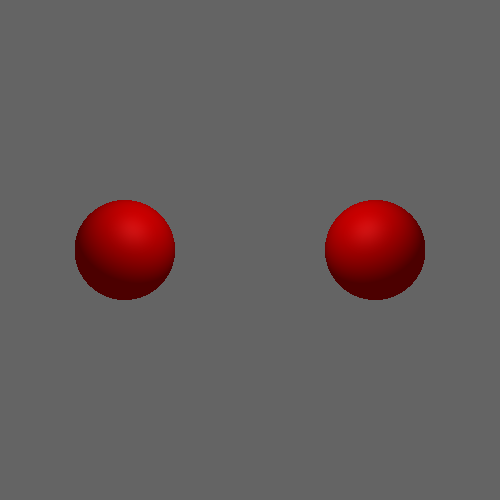

Basic CG-I Python Project Using Raycasting
=========================================

This project demonstrates a basic Computer Graphics (CG-I) engine using raycasting in Python. 

2 spheres, there's no light source yet

Requirements
------------
Make sure you have the following libraries installed:

- Pillow
- Tkinter

  
How to Run
-----------
To run this project, follow the steps below:

1. Clone the repository or download the project files.
2. Install the required libraries (if not already installed).
3. Run the script: main.py

